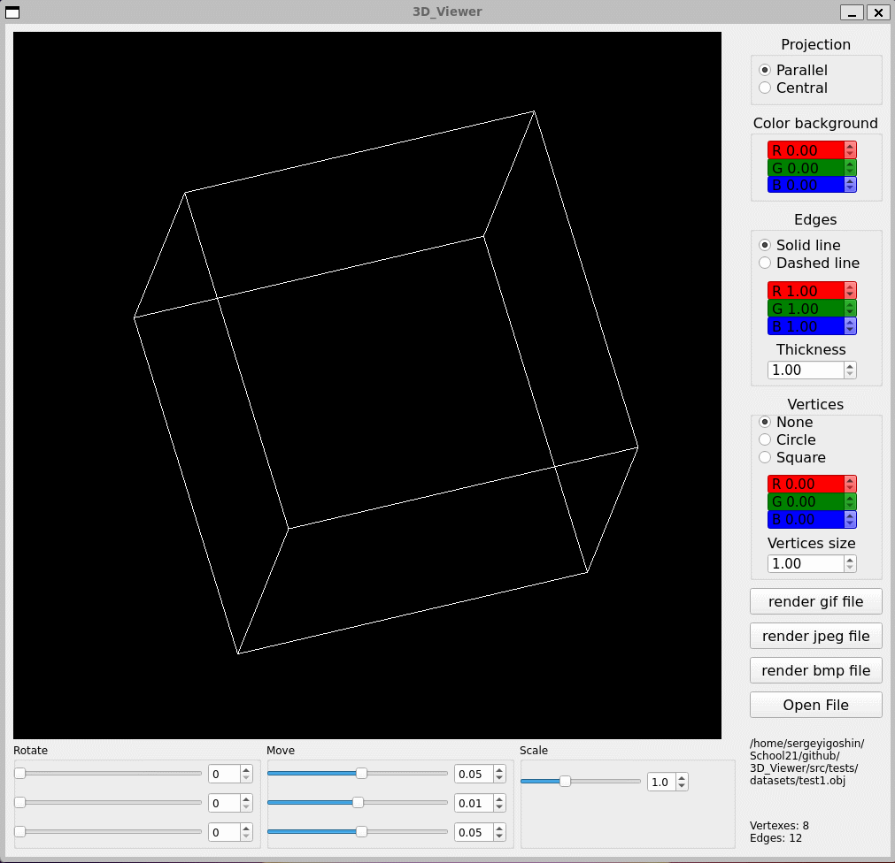

# 3DViewer

## Introduction

Реализация на языке программирования С++ в парадигме объектно-ориентированного программирования приложение для просмотра 3D моделей в каркасном виде.

## Part 1. 3DViewer

- Программа разработана на языке C++ стандарта C++17;
- В программе реализован графический пользовательский интерфейс, на базе GUI-библиотеки Qt:
- Программа реализована с использованием паттерна MVC;
- Использованы три паттерна проектирования - фасад, стратегия и синглтон;
- Программа предоставляет возможность:
    - Загружать каркасную модель из файла формата obj (поддержка только списка вершин и поверхностей);
    - Перемещать модель на заданное расстояние относительно осей X, Y, Z;
    - Поворачивать модель на заданный угол относительно своих осей X, Y, Z;
    - Масштабировать модель на заданное значение;
- Программа корректно обрабатывает и позволяет пользователю просматривать модели с деталями до 100, 1000, 10 000, 100 000, 1 000 000 вершин без зависания (зависание - это бездействие интерфейса более 0,5 секунды);

## Part 2. Настройки

- Программа позволяет настраивать тип проекции (параллельная и центральная);
- Программа позволяет настраивать тип (сплошная, пунктирная), цвет и толщину ребер, способ отображения (отсутствует, круг, квадрат), цвет и размер вершин;
- Программа позволяет выбирать цвет фона;
- Настройки сохраняются между перезапусками программы.

## Part 3. Запись
 
- Программа позволяет сохранять полученные («отрендеренные») изображения в файл в форматах bmp и jpeg;
- Программа позволяет записывать небольшие «скринкасты» - текущие пользовательские аффинные преобразования загруженного объекта в gif-анимацию (640x480, 10fps, 5s).

## Сборка

Сборка программы настроена с помощью Makefile

* `make install` - Сборка программы
* `make unistall` - Удаление программы
* `make dvi` - Генерирование документации через Doxygen
* `make dist` - Архивирование проекта
* `make test` - Покрытие unit-тестами c помощью библиотеки GTest
* `make style` - Проверка кода на Google style
* `make clean` - Удаление ненужных файлов

## Запуск 3D_Viewer

